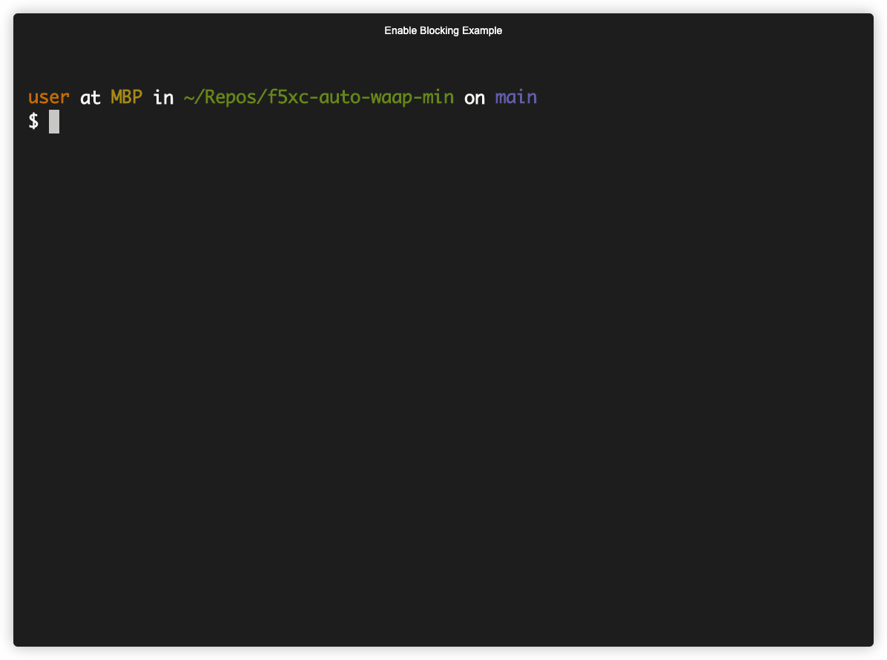

# f5xc-auto-waap-min

Minimalistic demo to show:
    - automated application enrolling with a default policy
    - automated update to existing web applications

## Components

- Origin Pool
- App Firewall
- HTTP Load Balancer

### Origin Pool 
This targets an existing URL.

### App Firewall
WAAP policy where config can be manipulated.

### HTTP Load Balancer
LB exposed to the internet. Object where WAAP is applied and bot policy is configured.

## Deploy
GitOps using Terraform Cloud. Commit to ``main`` and changes will be deployed to the F5xc tenant.

## Enable Blocking Example

```bash
 ~$ sed -i '' -e 's/blocking=false/blocking=true/' infra.tf
 ~$ git commit infra.tf -m "min-waap example" && git push -u origin main
 ~$ watch -n 5 curl -s "https://min-waap.gsa.f5demos.com/get/?cmd=cat%20/etc/passwd | jq ."
 ```

